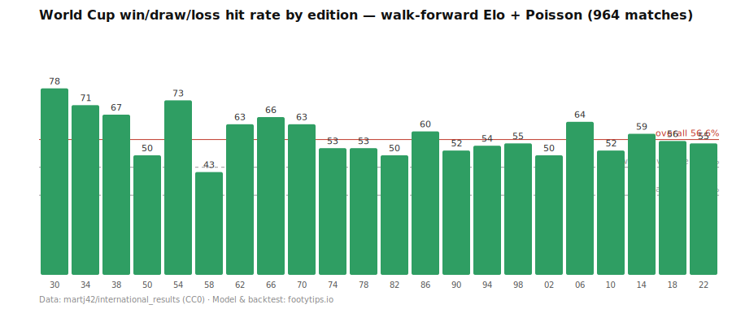

# World Cup Prediction Backtest — 22 Tournaments, 964 Matches

A fully reproducible backtest of the Elo + Poisson prediction model behind
**[FootyTips.io](https://footytips.io/)**, covering every FIFA World Cup from
1930 to 2022: **56.6% win/draw/loss hit rate, Brier score 0.570**, with no
future information used in any prediction.



## Quickstart

```bash
git clone https://github.com/tuofangzhe/footytips-worldcup-backtest
cd footytips-worldcup-backtest
npm install          # no dependencies — Node ≥ 20 built-ins only
npm run backtest     # downloads the open dataset, replays 96 years, prints results
```

Runs in a few seconds. The whole pipeline is ~250 lines across three files:
[`src/elo.mjs`](src/elo.mjs), [`src/poisson.mjs`](src/poisson.mjs),
[`src/backtest.mjs`](src/backtest.mjs).

## Method

**Walk-forward Elo.** We replay all ~49,000 international matches since 1872
in date order, updating each team's Elo after every result. K scales with
competition importance (World Cup 60, qualifiers 40, continental cups 45,
friendlies 20), weighted by goal difference, with a ±100 Elo home advantage
on non-neutral venues. Every team starts at 1500 — there are no hand-set
ratings anywhere.

**Poisson scorelines.** The Elo gap maps to expected goals per side
(λ = baseGoals · e^(eloToGoals · Δ)), which yields a full scoreline
probability matrix and the win/draw/loss probabilities.

**Dixon-Coles correction.** Independent Poissons slightly underestimate
draws; the 0-0/0-1/1-0/1-1 cells are corrected with the standard Dixon-Coles
τ (rho = −0.04).

**No future information.** For each historical World Cup match, the
prediction uses only the Elo available *before* kick-off; the match result is
applied to the ratings only afterwards. This walk-forward design is what the
hit rate actually measures — how the model would genuinely have performed at
the time.

**Honest disclosure.** The three model constants (`baseGoals = 1.20`,
`eloToGoals = 0.0024`, `rho = −0.04`) were calibrated for Brier score on the
modern era (1998+, 448 matches), so those editions are partially in-sample;
the shape of the results barely moves with reasonable parameter choices.
And ~56% is a strong but honest level — it is not a crystal ball.

## Results

| Edition | Hit rate | | Edition | Hit rate |
|---|---|---|---|---|
| 1930 | 78% | | 1982 | 50% |
| 1934 | 71% | | 1986 | 60% |
| 1938 | 67% | | 1990 | 52% |
| 1950 | 50% | | 1994 | 54% |
| 1954 | 73% | | 1998 | 55% |
| 1958 | 43% | | 2002 | 50% |
| 1962 | 63% | | 2006 | 64% |
| 1966 | 66% | | 2010 | 52% |
| 1970 | 63% | | 2014 | 59% |
| 1974 | 53% | | 2018 | 56% |
| 1978 | 53% | | 2022 | 55% |

**Overall: 56.6% (964 matches) · Brier 0.570**

Baselines: random guessing 33.3% · always picking the favourite ≈45% ·
professional football models typically 50–58%.

Yes, 1958 was rough (43%) — bad editions are part of an honest backtest.
Machine-readable results: [`results/backtest.json`](results/backtest.json).

## Live: World Cup 2026

The same engine runs FootyTips.io's World Cup 2026 predictions, with every
pick settled publicly after full time — including the misses:

**https://footytips.io/track-record/**

## References

The model is an original, dependency-free implementation of standard published
methods — none of the underlying math is ours, and that's the point:

- A. E. Elo, *The Rating of Chessplayers, Past and Present* (1978) — the rating
  framework, adapted to football via the
  [World Football Elo Ratings](https://www.eloratings.net/about) conventions
  (importance-scaled K, goal-difference multiplier, +100 home advantage)
  introduced by Bob Runyan (1997).
- M. J. Maher, *Modelling Association Football Scores*, Statistica Neerlandica
  36 (1982) — independent Poisson goal models.
- M. J. Dixon & S. G. Coles, *Modelling Association Football Scores and
  Inefficiencies in the Football Betting Market*, Applied Statistics 46.2
  (1997) — the low-score dependency correction (`dcTau`, rho).

What is ours: the from-scratch implementation, the parameter calibration
(Brier-optimal on the modern era), the 964-match walk-forward backtest, and
the public settlement ledger.

## Data & Credits

- Match results: [martj42/international_results](https://github.com/martj42/international_results)
  — every international match since 1872, released under CC0. Thank you, @martj42.
- World Cup 2026 fixtures (live site): [TheSportsDB](https://www.thesportsdb.com/).
- Code: MIT. Results and probabilities are estimates, not guarantees.

If you use this backtest or the numbers, please cite as **FootyTips.io**.
